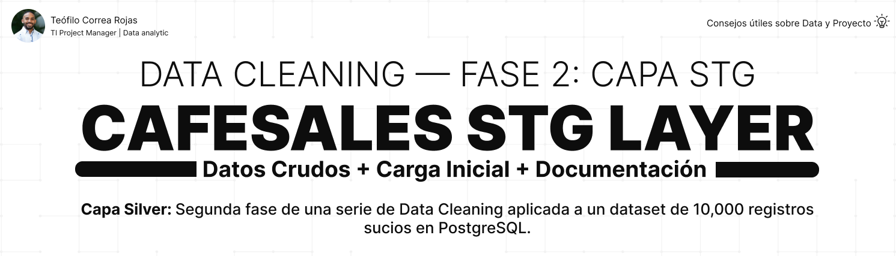

# CafeSales — STG Layer



## 📌 Descripción

Segunda fase de una serie de **limpieza de datos (Data Cleaning)**
en PostgreSQL. Este proyecto carga los 10,000 registros crudos de
un dataset real de ventas de cafetería en la capa STG, preservando
los datos sucios tal como vienen para su posterior diagnóstico y
limpieza.

---

## 🎯 Objetivos del proyecto

- Diseñar la tabla de staging para datos crudos
- Documentar el modelo como Diccionario de Datos
- Cargar los 10,000 registros del dataset original
- Preservar los datos sucios sin transformación
- Validar la integridad de la carga

---

## 🏗️ Contexto — Capa STG

```
Arquitectura Medallion
│
├── STG     ← este proyecto (datos crudos)
├── Bronze  ← Fase 3
├── Silver  ← Fase 4 (limpieza)
└── Gold    ← Fase 5 (análisis)
```
La capa STG almacena los datos exactamente como vienen del origen,
sin transformaciones. Es la "fotografía cruda" del dataset.

---

## 💡 Decisiones clave de esta capa

| Decisión | Razón |
|---|---|
| Todos los campos como `TEXT` | Los valores `ERROR` mezclados con números harían fallar tipos numéricos |
| Sin PRIMARY KEY | Podrían existir IDs duplicados o vacíos en datos sucios |
| Sin constraints | STG debe aceptar todo sin rechazar nada |

```
Filosofía de STG:
"Primero cargo, después valido"
```

---

## 📊 Sobre el dataset

```
Dataset: Cafe Sales - Dirty Data for Cleaning Training
Fuente:  Kaggle
Volumen: 10,000 registros
Columnas: 8
```

**Problemas de calidad presentes:**
- Valores de error (`ERROR`)
- Valores desconocidos (`UNKNOWN`)
- Valores nulos (`[null]`)
- Campos vacíos

---

## 🧱 Estructura del proyecto

```
CafeSales_STG_Layer/
│
├── asset/
│   └── banner_stg.png
│
├── dataset/
│   └── dirty_cafe_sales.csv
│
├── docs/
│   └── project_closure.md
│
├── sql/
│   └── 01_stg/
│       ├── create_tables/
│       │   └── 01_create_stg_sales.sql
│       ├── insert_data/
│       │   └── 01_load_stg_sales.md
│       ├── README.md
│       └── data_dictionary_stg.md
│
├── .gitignore
└── README.md
```

---

## 📖 Documentación

| Documento | Descripción |
|---|---|
| [README de la capa STG](sql/01_stg/README.md) | Reglas y decisiones de la capa |
| [Diccionario de Datos](sql/01_stg/data_dictionary_stg.md) | Definición de los 8 campos |
| [Cierre del proyecto](docs/project_closure.md) | Resumen y lecciones aprendidas |

---

## 🚀 Cómo usar

```
Ejecutar 01_create_stg_sales.sql
→ crea la tabla stg.sales
Cargar dirty_cafe_sales.csv
→ mediante el importador de DataGrip
Validar la carga
→ SELECT COUNT(*) FROM stg.sales;
→ resultado esperado: 10000
```
---

## 🔜 Fases del proyecto

| Fase | Proyecto | Enfoque |
|---|---|---|
| 1 | [CafeSales_Database_Infrastructure](https://github.com/teofilocorrea/CafeSales_Database_Infrastructure) | Infraestructura ✅ |
| 2 | CafeSales_STG_Layer | Datos crudos ← estás aquí |
| 3 | CafeSales_Bronze_Layer | Auditoría |
| 4 | CafeSales_Silver_Layer | Limpieza + análisis exploratorio ⭐ |
| 5 | CafeSales_Gold_Layer | Modelo dimensional + análisis de negocio |

---

## 👤 Autor

### Teófilo Correa Rojas

**TI Project Manager | Data analytic**

🔗 [LinkedIn](https://www.linkedin.com/in/teófilo-correa-rojas/)